# Rust Axum Web Service

I made this doc while listening to [Rust Axum Full Course](https://www.youtube.com/watch?v=XZtlD_m59sM). The notes are from the perspective of an experienced software dev knowledgeable in some mainstream programming languages but with 0 experience in Rust. I wanted to see if I could apply the [do things that don't scale](https://paulgraham.com/ds.html) approach. It was a bit of an overreach to try to learn Rust while learning from a video from a seasoned rust professional about best-practices. However, while it took me a while to pay attention to trailing `;` and `?` _(such significant semantics to those two characters)_, I could learn rust on demand while also learning about web-services in rust. Highly recommended if you already have some understanding of other general purpose programming languages. Totally saves you the time needed to first grok rust from books.

👉 I have not spent time on making this particularly useful to any specific audience. This worked for me and made sense on a second pass as well. I am moving this out of my private notes stash into the fork hoping it is of some use to someone on a similar journey.

## Resources

 - The main video by Jeremy Chone [Rust Axum Full Course](https://www.youtube.com/watch?v=XZtlD_m59sM)
 - Online and interactive [rust programming book](https://rust-book.cs.brown.edu/) with exercises.

### Video comments

I have picked some of the more useful comments for later study or implementation.
  - When failing on `delete`, return a **204 NoContent** to allow retry.
  - Instead of adding UUID only for response, allow the whole thing to be tracked easily by 
    - adding UUID to the request up-front using the ctx extractor
    - access it how downstream ? `response.Parts.extensions().get` ?
    - pass it to all branching operations (micro-service calls)

### Followups

  - [The youtube vidoes on his rust 10x site](https://rust10x.com/web-app) which list the evolution of this framework
  - [Github code for the same](https://github.com/rust10x/rust-web-app) which seems more current and has more annotations on the videos. Maybe start with this only.

**Further evolution**: Need to figure out basic app to allow me to extend this into a functioning web-app with other services (gen-ai, traditional nlp, animation).
  - Serve some front-end (React?)
  - Authentication (research and use), ACLs etc
  - React talks to backend via web-sockets(ws) or some rpc ?

> 👏 [Large official Axum example base](https://github.com/tokio-rs/axum/tree/main/examples) with many excellent use cases.


## Rust usages

This is remarkable and worth a mindmap only because I am starting out brand new. Just the idea that you could destructure a field directly in a function parameter list blew my mind: Not having to invent a name for the struct and deal with `a.b.c` to get to the field of interest: simply awesome! The power wielded by the tiny trailing `?`: wah! All in all, brevity of Scala, monadic composition/chaining and some excellent syntax choices. Absolutely loving this language. IMO Cargo in infinitely better than sbt! While the memory management looks to be involved, think C++ move semantics and you'll have a good starting point.

Decorating a class with `#[derive(Debug)]` is all that is needed to get some field-wise debug output. Keeping it as a library feature on baked into the language is such a great choice. The DX is lovely so far.


## Axum concepts


## Best practices


## Compatibility
 - Video was taken with Axum 0.6 but latest axum is 0.7.4 which breaks a few things.
 - Check [rust-axum-course githum](https://github.com/jeremychone-channel/rust-axum-course/) which has been updated to `axum=0.7.4` to update as needed.

# Create new project

See [README_MinimalRustSetup.md](../README_MinimalRustSetup.md) on how to setup rust and create new projects etc.

`cargo new projectName`

# Dependencies

Open up the `Cargo.toml` file and add the following

 - `tokio = { version = "1.36.0", features = ["full"] }`
 - `axum = "0.7"`

# Basic webserver responding on /hello
 
```rust
#![allow(unused)] // For beginning only

use std::net::SocketAddr;
use tokio::net::TcpListener;

use axum::Router;
use axum::{response::Html, routing::get};

#[tokio::main]
async fn main() {
    let routes_hello = Router::new().route(
        "/hello",
        get(|| async {Html("Hello <strong>World!!!</strong>")}),
    );

    // region - start server    
    let listener = TcpListener::bind("127.0.0.1:8080").await.unwrap();
	println!("->> LISTENING on {:?}\n", listener.local_addr());

    // serves can be composed he says.
    axum::serve(listener, routes_hello.into_make_service())        
        .await
        .unwrap();
    // endregion: -- start server        
}
```

Test using `curl http://localhost:8080/hello` or in a browser. Works great in WSL2.

# Adding tests

 - Add dependency on `httpc-test = "0.1.9"`
 - new `tests \ quick_dev.rs`

## test

```rust
#![allow(unused)]

use anyhow::Result;

#[tokio::test]
async fn quick_dev() -> Result<()> {

    let hc = httpc_test::new_client("http://localhost:8080")?;
    
    hc.do_get("/hello").await?.print().await?;

    Ok(())
}
```

# Continuous builds

> ensure you have `cargo-watch` installed first via `cargo binstall cargo-watch`

```console
cd parent
cargo watch -q -c -w src/ -x run
```
 - `-q` : quiet
 - `-c` : clear between recompiles
 - `-w` : file-system dirs/files to watch
 - `-x` : command to execute
 
 # Continuos tests 

 > install cargo-watch
 >
 > `sudo apt install libssl-dev`

 ```console
 cd parent
 cargo watch -q -c -w src/ -w tests/ -x "test -q quick_dev -- --nocapture"
 ```
  - `--nocapture` means don't capture stdout and print out as well
  - I can add a second `-w src/` to this to make it run when the source changes as well.

# Evolve the code

## use a separate handler instead of closure

> Rust statement vs expression mediated by `;`

```diff
async fn main() {
    let routes_hello = Router::new().route(
        "/hello",
-        get(|| async {Html("Hello <strong>World!!!</strong>")}),
+        get(handler_hello),
    );
    .....

+async fn handler_hello() -> impl IntoResponse {
+    println!("->> {:<12} - handler_hello", "HANDLER");
+    Html("Hello <strong>World!!!</strong>")
+}    
```

Multiple thing to note here
 - new `impl IntoResponse` return type.
 - No `;` at end of `Html(..)` which took me some investigating to figure
   - Makes it an expression which returns a type of `Html(..)` and the test works as expected
   - Adding a `;` makes it return a `()` and the test returns an empty response.

Will `impl IntoResponse` even accept a `()` without compiler error ? 🌟 apparently yes. The following compiles!!

```rust
async fn handler_hello() -> impl IntoResponse {
    println!("->> {:<12} - handler_hello", "HANDLER");   
    ()
}
```

## Take parameters as query params

> `#[derive(Debug, Deserialize)]` will automatically derive the class/struct from the supplied traits

 - Add dependency on `serde-json` a json codec
 - Define params struct with fields needed as `Options`
 - Add a Query arg to the handler than extracts struct from request params

```diff
[dependencies]
tokio = { version = "1.36.0", features = ["full"] }
axum = "0.7"

+# json
+serde = { version = "1", features=["derive"]}
+serde_json = "1"
```

```rust
use serde::Deserialize;
use axum::extract::Query;

--snip--

#[derive(Debug, Deserialize)]
struct HelloParams {
    name: Option<String>,
}

async fn handler_hello(Query(params): Query<HelloParams>) -> impl IntoResponse {
    println!("->> {:<12} - handler_hello - {params:?}", "HANDLER");
    Html("Hello <strong>World!!!</strong>")    
}
```

Ok..
 - 🌟 What is the significance of `Query(params)` when we simply expect the name of the parameter at that point. **Removing it and simply using `params` also works**. What gives ? Aah, took me a while to figure out that he saw saying: `Destructuring` is whats happening here.
 - `{params:?}`. Without the `:?` it complains that `params` does not implment `std::fmt::Display` and suggests that we could add `:?` to use `pretty-print` if that is implemented instead.

### Why is he saying destructuring ?

Why would you want `Query(param)` as the arg instead of `param`. [Destructuring of a struct](https://doc.rust-lang.org/rust-by-example/flow_control/match/destructuring/destructure_structures.html) explains what ?
 - `Query<T>(pub T)` ~~so we are actually creating an instance of `Query(param)` explicitly instead of some implicit conversion ? Destructuring is a red-herring ?~~
 - 👉 **Function arguments are not just names, they can be full patterns**
 - The fact that `params` was printed out correctly irrespective of wheter it was declared as `params` or `Query(param)` is just the way pretty-printing of `HelloParam` and `Query<HelloParam>` seemed to give the same outputs. The outputs were actually different.

 In the case of `handler_hello(Query(params): Query<HelloParams>)`
  - `Query(params)` is destructuring the argument of type `Query<HelloParams>` and giving us the constructor argument to `Query`. `params` is of type `HelloParams`
  - Pattern of form `Name(param1, param2)` indicates a tuple struct of the form `struct Name(type1, type2)` without named fields. If the fields were named, the pattern would change to `Name{ param1, param2}`

If `param` was not being destructured, then we can get to the underlying item of the `Query` tuple struct via `param.0`.


## Take parameters as path components

```diff
+ use axum::extract::Path;

let routes_hello = Router::new()
        .route("/hello", get(handler_hello))
+        .route("/hello2/:name", get(handler_hello2));
```

The above section indicates to Axum that the fist path component after "/hello2" is the name. Note that the name has no significance, just the order of the path component after "/hello2".

Add a new handler for this like this

```rust
// requests using URLS - `/hello2/Mike`
// Path<T> of type axum::extract::Path
async fn handler_hello2(Path(name):Path<String>) -> impl IntoResponse {
    println!("->> {:<12} - handler_hello2 - {name:?}", "HANDLER");
    Html(format!("Hello <strong>{name}!!!</strong>"))
}
```

Update the test as follows

```diff
async fn quick_dev() -> Result<()> {

    let hc = httpc_test::new_client("http://localhost:8080")?;
    
    hc.do_get("/hello?name=Jen").await?.print().await?;
+    hc.do_get("/hello2/Mike").await?.print().await?;

    Ok(())
}
```

## Prepare for composing routers

```diff
async fn main() {
-    let routes_hello = Router::new()
-        .route("/hello", get(handler_hello))
-        .route("/hello2/:name", get(handler_hello2));

+    let routes_all = Router::new().merge(routes_hello());

-axum::serve(listener, routes_hello.into_make_service())        
+axum::serve(listener, routes_all.into_make_service())        
        .await
        .unwrap();

 --snip--
}

+fn routes_hello() -> Router {
+    Router::new()
+        .route("/hello", get(handler_hello))
+        .route("/hello2/:name", get(handler_hello2))
+}
```

The `merge( other: Router) -> self` looks like it can be called in a cascade for subsequent merges.

## Add static serve routes

> Axum services are built on top of Tower (another lib)
> 
> Add dependencies on tower

**Cargo.toml**
```diff
+tower-http = {version = "0.5", features=["fs"]}
```

```rust
use tower_http::services::ServeDir;

--snip--

let routes_all = Router::new()
        .merge(routes_hello())
        .fallback_service(routes_static());
--snip--

fn routes_static() -> Router {
    Router::new().nest_service(
        "/", get_service(ServeDir::new("/."))
    )
}
```

 - Axum ensures no conflict in the routes
 - Since `"/"` override "/hello"" etc, it cannot be used as a regular route but has to be added as a `fallback` to consider when the other routes did not resolve.

 I added the following to print out the CWD of the server and it tourned out to be the parent of the src directory: _the location from which I am running `cargo watch -x run`.

```rust
use std::env;

println!("->> CWD {:?}\n", get_cwd());

fn get_cwd() -> String {
    match env::current_dir() {
        Ok(path) => path.into_os_string().into_string().unwrap(),
        Err(e) => {
            println!("Unable to get string: {e:?}");
            String::from("/dev/null")
        }
    }
}
```

So put in the following structure for testing.

```console
.
├── src/
├── tests/
└── web_root/index.html
```

```rust
fn routes_static() -> Router {
    Router::new().nest_service(
        "/", get_service(ServeDir::new("./web_root"))
    )
}
```

Update the test like so..

```rust
    hc.do_get("/index.html").await?.print().await?;
```

And it all works! With a longer payload, the response listing would be truncated.

```console
│=== Response for GET http://localhost:8080/index.html
=> Status         : 200 OK OK
=> Headers        :
   content-type: text/html
   accept-ranges: bytes
   last-modified: Fri, 01 Mar 2024 13:19:31 GMT
   content-length: 52
   date: Fri, 01 Mar 2024 13:23:22 GMT
=> Response Body  :
<html>
 <body> Hello from index.html</body>
</html>
```

## Reorganize - Add web module and login

### Add error codes

It is telling that the first thing to do is adding errors. This took multiple steps

 - Add error codes as Enum, derived from `Debug` to give it `{:?}`
 - Implement `std::fmt::Display` in terms of the existing `{:?}`
 - Implement `std::error::Error` for Error to mark that enum as an error
 - Implement `IntoResponse` trait for Error to convert it into an Axum response
   - ue axum's built-in ability to convert a tuple of (status-code, string) into a response for this.

The full code looks like below

```rust
use axum::{http::StatusCode, response::IntoResponse};

// Best-practice per Chone: 
// - Re-export the error and it's result in the parent module
//   to always have a matching pair of result,error.
// - Implement Display trait so {} can be used.
pub type Result<T> = core::result::Result<T, Error>;

// #[debug(Derive)] implements a fmt method which is used
// when specifying `?` for formatting: {obj:?} or {:?}
#[derive(Debug)]
pub enum Error {
    LoginFail,
}

// Axum Error as a response ------------------
// Chone: Key is to never ever pass server errors through to clients
//        Big security exposure
//
// Make the lazy path the safe path and by default don't send any extra info.
impl IntoResponse for Error {
    fn into_response(self) -> axum::response::Response {
        print!("->> {:<12} - {self:?}", "INTO_RES");

        // For now, simply convert all errors into a ISE
        (StatusCode::INTERNAL_SERVER_ERROR, "UNHANDLED_CLIENT_ERROR").into_response()
    }
}

// Boilerplate -------------------------------
impl std::fmt::Display for Error {
    // We are implementing this so that the following works
    //   let e = Error::LoginFail;
    //   println("Error is {}", e) 
    //
    // Impl is in terms of the existing {:?} provided via #[derive(Debug)]
    fn fmt(&self, fmt: &mut std::fmt::Formatter<'_>) -> std::fmt::Result {
        write!(fmt, "{self:?}")
    }
}

// Not sure what this does. Simply implements the trait with no overrides.
impl std::error::Error for Error {}
```

His emphasiszed advice is 
 - Never ever expose actual internal errors directly to clients
 - LoginFailed, whatever. Capture it and send it out as something with almost no details. In this case, use _INTERNAL_SERVICE_ERROR_. 
   - This is for security reasons. 
   - Implementing it like this from the get-go, allows us to be secure on the lazy path. i.e, _without doing anything extra you are secure_.

### Expose error codes in the main crate etc

 - In error.rs itself, expose the error and the result by making them `pub`.
 - In main.rs, export them via `pub use self::error::{Error, Result};`. _So it is exported at global as well as under error now ?_

### new web module

Slowly separating code out. Create a new web module. 

 - Since a bunch of things are going in here, choose to have a wed sub-dir and `web/mod.rs` instead of a `web.rs`.
 - also create a `routes_login` sub-module underneath it.

```
├── error.rs
├── main.rs
└── web
    ├── mod.rs
    └── routes_login.rs
```

## Add login logic

> 🛑 If you push this framework to production, you will remember to remove the sql that adds the `demo1/welcome` user. Right?

 - a struct to hold login params derived from `Debug` and `Deserialize`
 - use already defined error and result items

```rust
#[derive(Debug, Deserialize)]
struct LoginPayload {
    username : String,
    pwd : String
}
```

A route to process a POST request for login

```rust
pub fn routes() -> Router {
    // Uses the POST router.
    Router::new().route("/api/login", post(api_login))
}
```

A barebones handler that processes the login
 - hardcoded user/pwd for now. Eventually hit a db
 - eventually add cookies with the auth tokens
 - return Json response

```rust
// Use the Json extractor. 
// This is a body extractor (not header) and has to be the last argument ??
async fn api_login(payload: Json<LoginPayload>) -> Result<Json<Value>> {
    println!("->> {:<12} - api_login", "HANDLER");

    // Eventually actually hit the db etc. For now hardcoded
    if payload.username != "demo1" || payload.pwd != "welcome" {
        return Err(Error::LoginFail);
    }

    // TODO: Set cookies

    // Create success body
    let body = Json(json!({
        "result" : {
            "success": true
        }
    }));

    Ok(body)
}
```

Update the tests

```rust
let req_login = hc.do_post(
    "/api/login",
    json!({
        "username": "demo1",
        "pwd" : "welcome"
    }));

req_login.await?.print().await?;
```

Modified the test and verified that 
 - correct user/pwd gets an OK response
 - wrong one gets a 500 Internal Service Error status

## Layer a response mapper on top of all responses

Not sure 

```diff
    let routes_all = Router::new()
        .merge(routes_hello())
        .merge(web::routes_login::routes())
+        .layer(middleware::map_response(main_response_mapper))
        .fallback_service(routes_static());
```

```rust
use axum::middleware;
use axum::response::Response;

//---------------------------------------------------------------
// Response mapping layer. This becomes critical in figuring out 
// how to handle server and client errors.
//---------------------------------------------------------------
async fn main_response_mapper(res: Response) -> Response {
    println!("->> {:<12} - main_response_mapper", "RES_MAPPER");

    // An empty line to separate requests
    println!();

    // simply pass it along for now. 
    res
}
```

Once this is run the output during testing shows whats happening

```console
->> HANDLER      - handler_hello - HelloParams { name: Some("Jen") }
->> RES_MAPPER   - main_response_mapper

->> HANDLER      - handler_hello2 - "Mike"
->> RES_MAPPER   - main_response_mapper
                                                                       
->> HANDLER      - api_login
->> RES_MAPPER   - main_response_mapper
```

Our mapper which simply prints an extra line after it's print line is being used after each response.

## Add cookie middleware

> 🌟 **To have cookies available everywhere, the CookieManager layer has to be layered on top, i.e., the bottom most `.layer` invocation**
>
> Most middlewares are from tower

```diff
+ tower-cookies = "0.10"
```

```diff
    let routes_all = Router::new()
        .merge(routes_hello())
        .merge(web::routes_login::routes())
        .layer(middleware::map_response(main_response_mapper))
+       .layer(CookieManagerLayer::new())
        .fallback_service(routes_static());
```

### Cookie name constant

Add this as a constant in the web module: `web/mod.rs`. This will be reused in other parts of the system.

```rust
pub const AUTH_TOKEN: &str = "auth-token";
```

### Set the cookie during login

> 👉 This failed the first time around. I had to add `cookies: Cookies` arg to every handler for this to succeed.

**Supply cookies to the handler** _Now that there is a cookie layer, do all the handlers need to take the cookies as their first arg ?_

```diff
+ use tower_cookies::Cookies;
+ use tower_cookies::Cookie;

- async fn api_login(payload: Json<LoginPayload>) -> Result<Json<Value>> {
+ async fn api_login(cookies: Cookies, payload: Json<LoginPayload>) -> Result<Json<Value>> {
    --snip--
    .. login logic
+        cookies.add(Cookie::new( web::AUTH_TOKEN, "userName-expirationDate-Signature"));
    --snip--
}
```


## Rest API

He says his preferred architecture is like this. This tutorial will focus on some of these blocks


 - Mock model layer (with mock-store)


First the mod itself has to be referenced from the main module. _Without this, it won't even be compiled in_.

```diff
mod model;
```

Then the model is created in two parts
 - Model itself
 - Model Controller that exposese an API to manipulate the model.

### Model structs

```rust
#[derive(Clone, Debug, Serialize)]
pub struct Ticket {
    pub id: u64,
    pub title: String,
}
```

### Model controller 

👉 Also implements the mock model-store

This the data access layer for the model. Some details here

```rust
#[derive(Clone)]
pub struct ModelController {            
    tickets_store : Arc<Mutex<Vector<Option<Ticket>>>>
}

impl ModelController {
    pub async fn new() -> Result<Self> {
        Ok(Self {
            tickets_store : Arc::default(),
        })
    }
}
```

 - [Arc](https://doc.rust-lang.org/std/sync/struct.Arc.html) stands for `Atomically Reference Counted` and points to something that is atomically reference counted. 
   - Clone operation clones the Arc (i.e., the ref counter) and not the underlying Vector
   - When the last Refcounted Arc is gone, then the underlying storage is removed
   - think `std::shared_ptr` in C++ world
 - The underlying `Mutex` allows multiple such cloned `Arc` instances to maintain synchronized access to the Vector
 - The `Vector` implements a simple toy concept where
   - index is simply index into the vector
   - CRUD delete operation empties the index hence the `Option<Ticket>`
   - Keeps growing without end so suitable only for toy impls.

The ModelController impl 
 - He says, we can get away without an impl by simply using `Clone` on the ModelController.
 - However, actually making a `async` impl, allows us to retain the `new` while having the option to change the impl.
 - Not particularly significant as these things will likely always need to be refactored but the insight is valuable.


 ### ModelController CRUD - create

 Chone says he likes to add separate impl blocks for each of the CRUD methods. Alternately they could all be added into the one `impl ModelController` that also implements the new.


```rust
pub async fn create_ticket(&self, ticket_fc : TicketForCreate) -> Result<Ticket> {
        let mut store = self.tickets_store.lock().unwrap();

        let id = store.len() as u64;
        let ticket = Ticket {
            id,
            title : ticket_fc.title
        };
        store.push(Some(ticket.clone()));
        
        Ok(ticket)
    }
```

 - mutexes usually succeed so `.unwrap()` is reasonable. Apparently they can get poisoned in which case this could panic. The mutex's destructor will unlock when it get dropped (_rust's notion for going out of scope_) and it's `drop` gets executed.
 - C++, this would be a `shared_ptr<Ticket>` I'd think. Cloning Ticket to make it  
 - Specially remember to skip the `;` after `Ok(ticket)`

### ModelController CRUD - list_tickets

```rust
 pub async fn list_tickets(&self) -> Result<Vec<Ticket>> {
        let store = self.tickets_store.lock().unwrap();

        // filter will pass over Nones. So no need to check explicitly
        let tickets = store.iter()
            .filter_map(|t| t.clone())
            .collect();

        Ok(tickets)
    }
```

 - `.filter_map` is nice. Very similiar to scala here. `( x => x.clone())`
 - `.collect` can collect into a `list` or `set` also ?

### ModelController CRUD - delete_ticket

Update the main error block for _not_found_. Note the enum with arg. Everything is a struct is quite nice.

```diff
pub enum Error {
    LoginFail,

    // -- Model errors --
+    TicketDeleteFailIdNotFound { id: u64 },
}
```

```rust
 pub async fn delete_ticket(&self, id: u64) -> Result<Ticket> {
        let mut store = self.tickets_store.lock().unwrap();

        // Option.take will empty the Option
        // Second time this is called on the same ID, it will 
        // be a None
        let ticket = store.get_mut(id as usize)
            .and_then(|t| t.take());

        // If None, then error.
        ticket.ok_or(Error::TicketDeleteFailIdNotFound{id})
    }
```

 - `.and_then` only work when it is `Some`
 - `Option.take` empties it and changes to a None.
 - `.ok_or` converts to a `Result` if `Some` otherwise to an error.

### Handler - create_ticket

```rust
use axum::extract::State;
use axum::Json;
```

Starts out this way
 - `State` is the app-state that needs to be sent to all handlers he says. Likely some known concept in axum and top-down from what is added to the router. Is this the `Context` in his block diagram ?

```rust
async fn create_ticket(
    state : State<ModelController>,
    ticket_json : Json<TicketForCreate>,
) -> Result<Json<Ticket>> {
    todo!()
}
```
 - `State` and `Json` are both extractors

and using function arg destructuring, is changed to this

```rust
async fn create_ticket(
    State(model_controller) : State<ModelController>,
    Json(ticket) : Json<TicketForCreate>,
) -> Result<Json<Ticket>> {
    todo!()
}
```

and finally with body added becomes

```rust
async fn create_ticket(
    State(mc) : State<ModelController>,
    Json(ticket_fc) : Json<TicketForCreate>,
) -> Result<Json<Ticket>> {
    println!("->> {:<12} - create_ticket", "HANDLER");

    let ticket = mc.create_ticket(ticket_fc).await?;
    Ok(Json(ticket))
}
```

Note that `async` functions are waited on, joined via `await`. The `await?` is syntactic sugar for `return on error` and is equivalent to

```rust
 someAsyncCall.await match {
    Ok(val) => val,
    Err(error) => Return(error.into())
 }
```

### Handler - list_tickets and delete_ticket

```rust
async fn list_tickets(
    State(mc) : State<ModelController>    
) -> Result<Json<Vec<Ticket>>> {
    println!("->> {:<12} - list_tickets", "HANDLER");
    
    let ticket_list = mc.list_tickets().await?;
    Ok(Json(ticket_list))
}

// Note that beyond the state itself, the args are all
// either path or query or json body extractors.
async fn delete_ticket(
    State(mc) : State<ModelController>,
    Path(id) : Path<u64>,
) -> Result<Json<Ticket>> {
    println!("->> {:<12} - delete_ticket", "HANDLER");

    let del_ticket = mc.delete_ticket(id).await?;
    Ok(Json(del_ticket))
}
```

### Router with state

His router definition is as follows..

```rust
pub fn routes(mc : ModelController) -> Router {
    Router::new()
        .route("/tickets", post(create_ticket).get(list_tickets))
        .route("/tickers/:id", delete(delete_ticket))
        .with_state(mc)
}
```

🌟 Note the `with_state(mc)` which allows the state to be sent to all the handlers in this router.

Some confusing points here
 - single `/tickets` for both `post(create_ticket)` and `get(list_tickets)`
   - Differentiates based on POST vs GET
   - Need to see handlers to figure out that `create_ticket` takes a JSON body as params and `list_tickets` takes no params
 - Why `/tickets/:id` and not the clearer `/tickets/delete/:id` ? _in which case, it might be ordered first

### With AppState - extra

Chone mentioned this as an extra way of passing mutable state: not somethign we are doing in this tutorial but showing it for future use cases.

 - Use AppState with SubStates
 - Send in AppState instead of the SubState to `with_state` and it will transparently supply just the sub-state
   - this way, handlers will not be dependent on, nor know about other states

```diff
axum = { version.., features=["macros"]}
```

```rust
use axum::extract::FromRef;

#[derive(Clone, FromRef)]
struct AppState {
    mc : ModelController // sub-state 1
                         // redis connector etc.
}


// Can this take in an entire AppState and send it via
// .with_state(app_state.Clone())?
pub fn routes(mc:ModelController) -> Router {
    let app_state = AppState{mc};

    --snip--

    Router::new()
      --snip--
      .with_state(app_state)
}
```   

 - `FromRef` is a trait and also a macro. Can be implemented by us but using it like this as macro brings auto impl.
 - `FromRef` is what makes every property a sub-state that can be injected.
 - All of the handlers which expect `State<ModelController>` continue to work with no code changes as `mc` is a sub-state and `FromRef` takes care of it automagically.

 ### Update routes_all

 Theres a forward looking thign he is doing here, making main return a `Result<()>`: says it will help later when we initialize the model.

```diff
- async fn main() {
+ async fn main() -> Result<()> {
+   let mc = ModelController::new().await?;

    --snip--

    let routes_all = Router::new()
        .merge(routes_hello())
        .merge(web::routes_login::routes())
+       .nest("/api", web::routes_tickets::routes(mc))
        .layer(middleware::map_response(main_response_mapper))
        .layer(CookieManagerLayer::new())
        .fallback_service(routes_static());

    --snip--

+   Ok(())
}
```

Things to note
 - 🌟 `.nest("/api",..)` automatically exposes all routes added to it with a `/api` prefix. Great compositional design! My kind of people.

### Update  /api/tickets tests

```rust
let req_create_ticket = hc.do_post(
        "/api/tickets",
        json!({
            "title" : "Ticket AAA",
        })
);
req_create_ticket.await?.print().await?;

// list
hc.do_get("/api/tickets").await?.print().await?;
```


After triggering tests a couple of time (to end up with more than 1 ticket), add a delete test

```rust
// delete
hc.do_delete("/api/tickets/1").await?.print().await?;
```

Now, save again and see that 
 - first time, the delete succeeds
 - second time, the delete fails with ISE on the client side but with full details on the server side.

## Update to enforce logged-in state

We very quickly realize that the ticket api works even when not logged in (by commenting out the login during tests). 

Fairly small set of changes to make this work. Appreciating the ergonomics of axum quite a bit.

```diff
pub enum Error {
    LoginFail,

    // -- Authentication errors
+   AuthFailNoAuthTokenCookie,

    // -- Model errors --
    TicketDeleteFailIdNotFound { id: u64 },
}
```

New module `web::mw_auth` to hold the auth middlware.

```diff
+   // `.route_layer` only applies to these routes unlike a `.layer`
+   let auth_apis = web::routes_tickets::routes(mc.clone())
+       .route_layer(middleware::from_fn(web::mw_auth::mw_require_auth));

    let routes_all = Router::new()
        .merge(routes_hello())
        .merge(web::routes_login::routes())
-       .nest("/api", web::routes_tickets::routes(mc))
+       .nest("/api", auth_apis)
        .layer(middleware::map_response(main_response_mapper))
        .layer(CookieManagerLayer::new())
        .fallback_service(routes_static());
```

To note
 - `.route_layer` is a layer that only applies to the routes in that route object. a `.layer` would apply to the entire set of routes and layered with the other layers all on top of any route. I like this design.
 - `.middleware.from_fn`


And the main middleware in `mw_auth.rs`

```rust
use axum::body::Body;
use axum::http::Request;
use axum::response::Response;
use axum::middleware::Next;
use tower_cookies::{Cookie, Cookies};

use crate::{Error, Result};

// Middleware that will require authentication
use crate::web::AUTH_TOKEN;

// Parameterized by B for body
//  req the original request
//  next is the filter it goes through ?
//
// Sits in the middle and has the whole power of the extractors
pub async fn mw_require_auth(
    cookies: Cookies,
    req: Request<Body>, 
    next: Next
) -> Result<Response> {

    // FIXME: Do real aut-token parsing and validation
    let auth_token = cookies.get(AUTH_TOKEN)
        .map(|c| c.value().to_string());

    // Fail if no token.
    auth_token.ok_or(Error::AuthFailNoAuthTokenCookie)?;

    Ok( next.run(req).await)
}
```
 - Simplistic check for the cookie. No validation of the cookie itself.


Finally the tests
 - comment out the login and run. Expect client side failures and server side AuthTokenMissing errors.

## parse auth-token cookie

 Add dependency on `lazy-regex` which provides
  - lazy regex compilation
  - macros

Update Cargo.toml
```diff
+ lazy-regex = "2"
```

Add a new error enum value.
```diff
pub enum Error {
+   AuthFailTokenWrongFormat,
}
```

```rust
fn parse_token(token: String) -> Result<(u64, String, String)> {
    // Depends on the lazy-regex crate
    let (_whole, user_id, exp, sign) = regex_captures!(
        r#"^user-(\d+)\.(.+)\.(.+)"#, // a literal regex
        &token
    ).ok_or(Error::AuthFailTokenWrongFormat)?;

    let user_id : u64 = user_id
        .parse()
        .map_err( |_| Error::AuthFailTokenWrongFormat)?;

    Ok((user_id, exp.to_string(), sign.to_string()))
}
```

 - Looks like `user_id.parse` works and it figures out the type based on return! different from scala. I would have thought you needed `user_id.parse<u64>`. A benefit of not allowing overloads: type inference can use function return type!
 - from the regex, type of `exp` is `&str`. So need to convert to `String` using  `.to_string()`. This will become tiresome without automatic copy constructors but maybe I'll grow to love _(or atleast tolerate)_ the overall benefits of this design.

 Now use it in the auth code. So nice, these monadic combinators.

```rust
let (user_id, exp, sig) = auth_token
    .ok_or(Error::AuthFailNoAuthTokenCookie)
    .and_then(parse_token)?;
```

## Create and pass context

He says that parsing the token is nice and all but it would be nice to have the user-id available to all the API methods so they can add to their logs, enforce acls (_allow deletion only by author_) etc.

He calls this the **context**
 - Add this at the top-level module level so everyone can use it (same level as main)

### Design of the ctx

```rust
#[dervice(Clone, Debug)]
pub struct Ctx {
    user_id: u64,
}

// Constructor
impl Ctx {
    pub fn new(user_id: u64) -> Self {
        Self { user_id }
    }
}

// property accessor
impl Ctx {
    pub fn user_id(&self) -> u64 {
        self.user_id
    }
}
```

 - Struct and then two separate impl blocks for ctor and accessor
 - note `Self` vs `self`
 - 🌟 He reiterates that this way _(prvate field, not public setter)_, no one outside the module can edit the user_id in the ctx. This looks conceptually like an opaque type: in C++ it would be a `public const getter` with no set method except ctor and that would be protected or private etc. Here though, struct is `pub`, maybe I am missing something and should actually read the language basics first. There is a risk in guessing semantics of a brand new language.

## Create a custom extractor for our context

His original code required the use of a `async-trait` dependency. However, the latest rust release (_I have 1.76_), it is not needed any more. See the following for context.
 - https://crates.io/crates/async-trait 
 - https://www.reddit.com/r/rust/comments/1784xuo/async_traits_and_rpitit_merged/ 
 - https://github.com/rust-lang/rust/pull/115822#issuecomment-1762750427


### Actual extractor code

```rust
#[async_trait]
impl<S: Send + Sync> FromRequestParts<S> for Ctx {    
    type Rejection = Error;

    async fn from_request_parts(parts: &mut Parts, _state: &S) -> Result<Self> {
        
        println!("->> {:<12} - Ctx", "Extractor");

        // cookie extractor
        // .extract comes from axum::extract::FromRequestParts
        let cookies = parts.extract::<Cookies>().await.unwrap();
        let (user_id, exp, sig) = get_validated_auth_cookie(cookies)?;

        Ok(Ctx::new(user_id))
    }
}

fn get_validated_auth_cookie(cookies: Cookies) -> Result<(u64, String, String)> {
    // FIXME: Do real auth-token parsing and validation
    let auth_token = cookies.get(AUTH_TOKEN)
        .map(|c| c.value().to_string());

    // Fail if no token.
    // Parse it if it is present
    // FIXME: Validate it.
    auth_token
        .ok_or(Error::AuthFailNoAuthTokenCookie)
        .and_then(parse_token)
}
```

 - `Rejection = Error` uses my Error type. _This is a type alias_
 - [Send and Sync traits](https://doc.rust-lang.org/nomicon/send-and-sync.html): Isn't this awesome to have thread-safety that can be compiler enforced!
 - refactored the cookie extraction code into `get_validated_auth_cookie(..)`

 ### Using ctx extractor in mw_auth

 With the extractor, we now have an impl for the `FromRequestParts` trait that axum uses. This is used thusly

```diff
 pub async fn mw_require_auth(
-    cookies : Cookies,    
+    ctx: Result<Ctx>,
 --snip--
{
    println!("->> {:<12} - mw_auth_token", "MIDDLEWARE");
-    bunch of code to read and validate the cookie    
+    ctx?;
    Ok( next.run(req).await)
}
```

Chone says that the extractor can be injected into this function in many ways
 - `Request<Ctx>`
 - `Option<Ctx>`
 - `Ctx`

 There are consequences to choosing each though.

  - If `Ctx` is chosen, then `mw_require_auth(ctx: Ctx)` will only be called when the ctx is created correctly. Likely a `.and_then()` chain on the `Result<Ctx>` from the extractor. **Simplifies error logic as the mw_auth or other methods do not have to error check**.
  - If `Request<Ctx>` is chosen _(and similar for `Option<Ctx>`)_, then, `mw_auth` is always called and its body has to assert on `Ok` via `ctx?;`.

 Not clear which approach is best though. Depends on what else can be done in `mw_require_auth` other that simple panic on no-context.

 ### Use ctx in model CRUD operations

```diff
 pub struct Ticket {
    pub id: u64,
+    pub cid:u64, // creator user_id
    pub title: String,
}
```

and in all the handlers, simply pass the ctx (_this will be injected automatically using the extractor somehow_)

```diff
async fn create_ticket(
    State(mc) : State<ModelController>,
+   ctx: Ctx,
    Json(ticket_fc) : Json<TicketForCreate>,
) -> Result<Json<Ticket>> {
```

👉 He has chosen to add `Ctx` instead of `Option<Ctx>` etc. This will be case by case choice I guess. However, API access gated through login is reasonable and we simply fail the access up front. Will be horrific to do validation in each API method so just use `Ctx` and the method won't even be called when the user is not authenticated.

### Avoid extractor running multiple times

The code above. Since the extractor is used in the mw_auth middleware layer and the API calls: is built twice. When we do implement validation, this can be expensive since it might involve a database call.

This is avoided by using a new middleware which essentially puts the extracted context into the request's builtin store.

> Says important to not fail in these middlewares so that the handlers have a chance to handle the errors. Must be other objectives in there that'll become clearer with experience.

```rust
pub async fn mw_ctx_resolver(
    _mc : State<ModelController>,
    cookies: Cookies,
    mut req: Request<Body>, 
    next: Next
) -> Result<Response> {

    println!("->> {:<12} - mw_ctx_resolver", "MIDDLEWARE");

    let auth_token = cookies.get(AUTH_TOKEN)
        .map(|c| c.value().to_string());

    let result_ctx = match auth_token
        .ok_or(Error::AuthFailNoAuthTokenCookie)
        .and_then(parse_token)
        {
            Ok((user_id, _exp, _sign)) => {
                Ok(Ctx::new(user_id))
            }
            Err(e) => Err(e)
        };

    // If cookie is present but has wrong format, reset it
    if result_ctx.is_err()
        && !matches!(result_ctx, Err(Error::AuthFailNoAuthTokenCookie))
    {
        cookies.remove(Cookie::from(AUTH_TOKEN));
    }

    // Save the ctx result into the request extension
    // this is a store by type: i.e., can only insert one item of a type
    req.extensions_mut().insert(result_ctx);

    Ok( next.run(req).await)
}
```

 - Pretty much move cookie parsing logic into this
 - Note the block right after `.and_then(parse_token)` - Pretty nice.
 - The main things are 
   - `mut req: Request<Body>`
   - `req.extensions_mut().insert(result_ctx)`


The existing extractor is modified to simply get this ctxt from the extension.

```rust
#[async_trait]
impl<S: Send + Sync> FromRequestParts<S> for Ctx {    
    type Rejection = Error;

    async fn from_request_parts(parts: &mut Parts, _state: &S) -> Result<Self> {
        
        println!("->> {:<12} - Ctx", "Extractor");

        parts
            .extensions
            .get::<Result<Ctx>>()
            .ok_or(Error::AuthFailCtxNotInRequestExt)?
            .clone()        
    }
}
```
 - `req.extensions` for reading here becomes `Parts.extensions`
 - Adds a new error `AuthFailCtxNotInRequestExt`

 Finally, add this context layer just below the cookie layer (i.e. preceeding it's .layer call)

```diff
     let routes_all = Router::new()
        .merge(routes_hello())
        .merge(web::routes_login::routes())
        .nest("/api", auth_apis)
        .layer(middleware::map_response(main_response_mapper))
+       .layer(middleware::from_fn_with_state(
+           mc.clone(),
+           web::mw_auth::mw_ctx_resolver))
        .layer(CookieManagerLayer::new())
        .fallback_service(routes_static());
```

 - Since we are sending it state, it is done via `middleware::from_fn_with_state`

## Create client errors and map server errors to client errors

> This is where the map_reponse comes in.
>
> **Status → Client Error**


add two more dependencies

```diff
+strum_macros = "0.24"
+uuid = {version = "1", features=["v4", "fast-rng",]}
```
 - `strum_macros` will help serialize enums
 - `uuid` for per-request identity

### create client errors

```rust
#[derive(Debug, strum_macros::AsRefStr)]
#[allow(non_camel_case_types)]
pub enum ClientError {
    LOGIN_FAIL,
    NO_AUTH,
    INVALID_PARAMS,
    SERVICE_ERROR,
}
```

 - Note that he used upper-snake-case which is against convention. Annotates with `#[allow(non_camel_case_types)]` to quiet the compiler
 - Also derives from `strum_macros::AsRefStr` to add `ClientError.LOGIN_FAIL.as_ref() -> &str`. `Error` is also derived from `strum_macros::AsRefStr`

## new method to convert server errors to client errors and HTTP server status

```rust
impl Error {
    pub fn client_status_and_error(&self) -> (StatusCode, ClientError) {
        match self {
            // -- Login operation
            Self::LoginFail => (
                StatusCode::FORBIDDEN,
                ClientError::LOGIN_FAIL
            ),
            // -- Auth
            Self::AuthFailCtxNotInRequestExt
            | Self::AuthFailNoAuthTokenCookie
            | Self::AuthFailTokenWrongFormat => (
                StatusCode::FORBIDDEN,
                ClientError::NO_AUTH
            ),
            // -- Model
            Self::TicketDeleteFailIdNotFound { .. } => (
                StatusCode::BAD_REQUEST,
                ClientError::INVALID_PARAMS
            ),            
            // -- fallback
            _ => (
                StatusCode::INTERNAL_SERVER_ERROR,
                ClientError::SERVICE_ERROR
            ),
        }
    }
}
```

 - Added as a method on `Error`
 - Notice the `{..}` to ignore the fields when destructuring/matching on `Self::TicketDeleteFailIdNotFound`

## Map error through to final response

All handlers return a response. When the response is an error, the `Error.IntoResponse` method is called. Instead of returning the generic server status of `INTERNAL_SERVER_ERROR`, we tailor if to the `ClientError` used. When considering `Error.IntoResponse` and `main_response_mapper`, This is done in two steps.


### Inject error into placeholder response

```rust
impl IntoResponse for Error {
    fn into_response(self) -> axum::response::Response {
        println!("->> {:<12} - {self:?}", "INTO_RES");

        // Create a place-holder reponse in response extension
        // This will be filtered/sanitized via map response
        let mut response = StatusCode::INTERNAL_SERVER_ERROR.into_response();

        // insert error into the response
        response.extensions_mut().insert(self);

        response
    }
}
```

### Map client error into client json response

```rust
async fn main_response_mapper(res: Response) -> Response {
    println!("->> {:<12} - main_response_mapper", "RES_MAPPER");

    // a uuid to track responses for debug purposes
    let uuid = Uuid::new_v4(); 

    // get the eventual response error
    // note that map only work when Ok()
    let service_error = res.extensions().get::<Error>();
    let client_status_error = service_error.map(|se| se.client_status_and_error());

    // Note that if there is an error, the response built in a placeholder
    // so we build the correct one here.
    let error_response = client_status_error
        .as_ref()
        .map(|(status_code, client_error)| {
            let client_error_body = json!({
                "error" : {
                    "type" : client_error.as_ref(),
                    "req_uuid": uuid.to_string(),
                }
            });

            println!("->> client_error_body: {client_error_body}");

            // StatusCode implements Copy. Dereferencing it via *
            // makes a copy.
            // Axum has builtin `into_response` for this tuple.
            (*status_code, Json(client_error_body)).into_response()
        });

    // -- TODO:  build and log the server log line
    println!("    ->> server log line - {uuid} - Error : {service_error:?}");
 
    // An empty line to separate requests
    println!();

    // Return the error response if available otherwise the 
    // original incoming response.    
    error_response.unwrap_or(res)    
}
```

## Finalize request/server log lines

```plantuml
@startmindmap
* Text Output

** Tracing
***_ Debug output on console or log files
***_ Lots of information to walk through events
***_ **mostly for offline reading of logs**

** Request  Logs
***_ focused on errors and alerts
***_ added in console logs
***_:🌟 **usually surfaced in cloud monitoring alerts** 
        and monitored with some cloud-native tool;

***_ **flat, non-nested info** to allows for easy query
@endmindmap
```




### new module - req_log

create a new module to perform the request logging.

```rust
use std::time::{SystemTime, UNIX_EPOCH};

use crate::{ctx::Ctx, error::ClientError, Error, Result};
use axum::http::{Method, Uri};
use serde::Serialize;
use serde_json::{json, Value};
use serde_with::skip_serializing_none;
use uuid::Uuid;
```
 - `serde_with` offers additional serialization Json hints that we use later on.
 - `std::time` is for timestamp generation
 - rest are for serialization and the stuff that we want to log


```rust
#[skip_serializing_none] // don't realize Option == None
#[derive(Serialize)]
struct RequestLogLine {
    uuid : String,      // uuid string formatted
    timestamp : String, // (should be iso8601)

    // -- user and context info
    user_id: Option<u64>,

    // -- http request attributes
    req_path : String,
    req_method: String,

    // -- Error attributes
    client_error_type: Option<String>,
    error_type : Option<String>,
    error_data : Option<Value>,
}
```
 - The stuff that we want to log along with the request itself.
 - Note the number of `Option<>` types.
 - The `#[skip_serializing_none]` tells serde to not serialize `None` items. This compacts the logs by only printing `Some` items.

 add a function to build a `RequestLogLine` instance up.

```rust
 pub async fn log_request(
    uuid: Uuid,
    req_method: Method,
    uri : Uri,
    ctx : Option<Ctx>,
    service_error: Option<&Error>,
    client_error: Option<ClientError>,
) -> Result<()> {
    
    // says use UTC time eventually.
    // use chrono
    // chrono::offset::Utc::now() // returns DateTime<Utc>
    let timestamp = SystemTime::now()
        .duration_since(UNIX_EPOCH)
        .unwrap()
        .as_millis();

    let error_type = service_error.map(|se| se.as_ref().to_string());

    // Error derives from Serialize
    // serde(tag="type", content="data") results in json like {"type" : tag, "data": contents}
    let error_data = serde_json::to_value(service_error)
        .ok()
        .and_then(|mut v| v.get_mut("data").map(|v| v.take()));

    // create the log req
    let log_line = RequestLogLine {
        uuid: uuid.to_string(),
        timestamp : timestamp.to_string(),

        req_path : uri.to_string(),
        req_method : req_method.to_string(),

        user_id : ctx.map(|c| c.user_id()),

        client_error_type : client_error.map(|e| e.as_ref().to_string()),
        error_type,
        error_data
    };

    // We are printing it here but 
    // eventually send to cloud-watch type of service (whatever the 
    //   cloud you are running on uses)
    println!("    ->> log_request: \n{}", json!(log_line));

    Ok(())
}
```
 - He says we'd want to use UTC (ISO..) time format in prod.
 - Note that error_data expects a `data` key. This is generated by the `serde(tag="type", content="data")` annotation on the Error enum. When the enum variant is a struct, the contents are serialized under a `data` json field.

 and finally, this is called from the `main_response_mapper` layer.

```rust
 async fn main_response_mapper(
    ctx: Option<Ctx>,
    uri: Uri,
    req_method: Method,
    res: Response) -> Response {
    println!("->> {:<12} - main_response_mapper", "RES_MAPPER");

    // a uuid to track responses for debug purposes
    let uuid = Uuid::new_v4(); 

    // get the eventual response error
    // note that map only work when Ok()
    let service_error = res.extensions().get::<Error>();
    let client_status_error = service_error.map(|se| se.client_status_and_error());

    // Note that if there is an error, the response built in a placeholder
    // so we build the correct one here.
    let error_response = client_status_error
        .as_ref()
        .map(|(status_code, client_error)| {
            let client_error_body = json!({
                "error" : {
                    "type" : client_error.as_ref(),
                    "req_uuid": uuid.to_string(),
                }
            });

            println!("->> client_error_body: {client_error_body}");

            // StatusCode implements Copy. Dereferencing it via *
            // makes a copy.
            // Axum has builtin `into_response` for this tuple.
            (*status_code, Json(client_error_body)).into_response()
        });

    // build and log the server log line    
    let client_error = client_status_error.unzip().1;
    log_request(uuid, req_method, uri, ctx, service_error, client_error).await;     

    println!("    ->> server log line - {uuid} - Error : {service_error:?}");

    // An empty line to separate requests
    println!();

    // Return the error response if available otherwise the 
    // original incoming response.    
    error_response.unwrap_or(res)    
}
```
 - We added the `ctx: Option<Ctx>`, `uri: Uri` and `req_method: Method` args to this with no other upstream changes. **This is part of the Axum extractor magic**. Any arg that can be extracted can be injected. **In any order**.
 - Note the `unzip()` call. It converts `Option<(A, B, C)>` into `(Option<A>, Option<B>, Option<C>)`